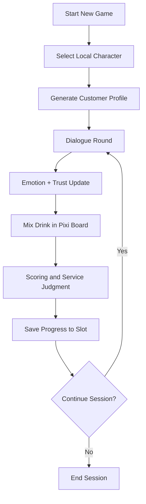
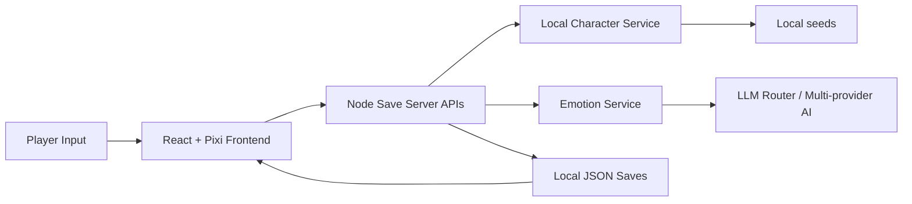

# Resonant Sips

**English** | [简体中文](README.zh-CN.md)

Resonant Sips is an interactive cyberpunk bartending narrative game.  
Players read customers, infer hidden emotions, and mix drinks that influence trust, story progression, and outcomes.

## Project Snapshot

- **Integrated novelty**: Multi-provider LLM routing + 8-emotion inference + Pixi interactive mixing + local character ingestion are integrated into one playable loop (not isolated demos).
- **Runnable repository**: `npm run dev` starts client+server, `.env.example` documents required configuration, and `npm run build` provides production output.
- **Documented gameplay workflow**: end-to-end gameplay/voiceover walkthrough is documented in `public/preview/gameplay-voiceover-guide-en.md`.
- **Public game demo video**: playable walkthrough is published on YouTube for a quick project overview: <https://www.youtube.com/watch?v=o8gpBwI3ihs>.
- **Local character library**: character profiles and portraits are loaded only from repository-owned local assets, with MCP-style endpoints under `/api/mcp/...`.

Key reference paths:

- `README.md` (run/config/workflow)
- `README.zh-CN.md` (Chinese mirror)
- `process book - English - 2026-04-25.md` (English process book)
- `process book - Chinese - 2026-04-25.md` (Chinese process book)
- `SD5976 Process Book.pdf` (hand-finished English process book PDF)
- Optional: `npm run pdf:process-book:en` exports `process book - English - 2026-04-25.md` to `Resonant-Sips-Process-Book-English-2026-04-25.pdf` (when you need an automated re-export from Markdown)
- `DOC/README.md` (documentation index and maintenance rules)
- `DOC/当前状态与已完成.md` (implementation-aligned current status)
- `DOC/开发计划与路线图.md` (planned work and acceptance criteria)
- `server/local-character-service.mjs`, `server/save-server.mjs`, `server/emotion-service.mjs`

## Academic Integrity and Copyright

- Asset provenance register: `ASSET_ATTRIBUTION.md`
- Ethics and usage scope: `ETHICS_AND_USE.md`
- Character seed compliance requirements: `seeds/characters/README.md`
- Storyboard role reference policy: role IDs follow `xxxxg` format; for each shown role, cite Storyworld character source and dataset source.

Attribution practice:

- Keep all visual assets for project continuity, and disclose references by shown role ID.
- If original creator name is unknown, use ID-level reference: `Role ID + upstream URL + access date + non-commercial project-context note`.

## Implementation Highlights

### 1) Integrated Technical Novelty

This project combines multiple state-of-the-art capabilities in one playable loop:

- Multi-provider LLM routing (Gemini / DeepSeek / OpenAI-compatible endpoints).
- Optional remote TTS with strict transcript-to-text sync guard.
- Character ingestion from local JSON/YAML profiles.
- 8-axis emotion modeling (Plutchik-inspired) linked to dialogue and mixing.
- Real-time interactive mixing board rendered with Pixi.js.

What is original in this repository is the integration logic: local character data, emotion inference, dialogue behavior, and bartending mechanics are stitched into one coherent gameplay system rather than isolated demos.

### 2) Repository Engineering Quality

- The repository is runnable locally with documented setup.
- The full gameplay workflow is represented in code and docs (including voiceover demo guide).
- The project exposes local character data through MCP-style APIs.

### 3) Iterative Team Development

The project was developed through short iteration cycles across gameplay logic, AI integration, UI/asset polish, and documentation updates.  
Rather than shipping isolated experiments, the team repeatedly consolidated features into a stable playable loop, then refined reliability and presentation quality.  
Contribution history is visible in git commits from multiple members, with work spread across frontend interaction, backend services, assets, and writing.  
For the current collaboration snapshot and implementation status, see `DOC/当前状态与已完成.md`.

### 4) Local Character and MCP-style Usage

- Loads character profiles and portraits only from local repository directories.
- Exposes and consumes HTTP MCP-style routes under `/api/mcp/...` for character lookup and emotion analysis.

## Tech Stack

- Frontend: React 18, Vite 5
- Rendering: Pixi.js 8
- Backend service: Node.js HTTP server (`server/save-server.mjs`)
- Data persistence: file-based JSON saves (`saves/`, `seeds/`)
- AI integration: OpenRouter/OpenAI-compatible endpoints, Gemini/DeepSeek config
- Character format parsing: YAML

## Prerequisites

- Node.js 18+
- npm 9+

## Setup

```bash
git clone <your-repo-url>
cd RESONANT-SIPS
npm install
```

## Environment Configuration

1. Copy `.env.example` to `.env.local`.
2. Fill your real API keys/endpoints in `.env.local`.
3. Keep `.env.local` private (already gitignored).

Core variables:

- `VITE_AI_PROVIDER` (`gemini` or `deepseek`)
- `VITE_GEMINI_API_KEY`, `VITE_GEMINI_MODEL`, `VITE_GEMINI_ENDPOINT`
- `VITE_DEEPSEEK_API_KEY`, `VITE_DEEPSEEK_MODEL`, `VITE_DEEPSEEK_ENDPOINT`
- `VITE_CHARACTER_IMAGE_MODEL`, `VITE_CHARACTER_IMAGE_ENDPOINT`
- `VITE_ENABLE_REMOTE_TTS`, `VITE_REMOTE_TTS_ENDPOINT`, `VITE_REMOTE_TTS_MODEL`
- `VITE_TTS_STRICT_TEXT_SYNC` (recommended `1`)

Notes:

- Character lookup is always local-only and reads from `seeds/characters/` and supported local repository directories.
- Server-side AI-backed routes also read from root `.env.local`.

## Network Access Notes (CN/HK)

If you are in mainland China or some HK networks, you may need VPN because default configs can hit blocked/unstable domains:

- `openrouter.ai` (default LLM/TTS endpoint in `.env.example`)
- `generativelanguage.googleapis.com` (Google Gemini native endpoint)

To reduce VPN dependency:

1. Use DeepSeek endpoint in `.env.local` (`VITE_AI_PROVIDER=deepseek` + DeepSeek key).
2. Optional: disable remote TTS (`VITE_ENABLE_REMOTE_TTS=0`) if OpenRouter is blocked.

Copy-paste presets are documented in:

- `DOC/运行配置与资产维护.md`

Profile switch commands:

- `npm run env:cnhk`
- `npm run env:global`

## Run Locally

Start frontend + save server together:

```bash
npm run dev
```

Useful split commands:

```bash
npm run dev:client
npm run dev:server
```

Default ports:

- Client (Vite): `http://localhost:5173`
- Save/API server: `http://127.0.0.1:3001`

Health check:

```text
GET http://127.0.0.1:3001/health
```

## Build

```bash
npm run build
npm run preview
```

## Path Safety Check

Before committing asset/file-structure changes, run:

```bash
npm run check:paths
```

Path policy document:

- `DOC/运行配置与资产维护.md`

## Gameplay Workflow

Typical workflow represented in this repo:

1. Select a character from the local seed library.
2. Generate playable customer profile from character context.
3. Run dialogue + hidden emotion inference + trust progression.
4. Mix cocktail in Pixi interface (Body / Sweetness / Strength style axes).
5. Evaluate service outcome and persist progression to save slots.

### Gameplay Flow



### Logic / System Workflow



For narration script structure, see:

- `public/preview/gameplay-voiceover-guide-en.md`

## Game Demo Video

The latest playable demo is published here:

- YouTube: <https://www.youtube.com/watch?v=o8gpBwI3ihs>

This demo presents the full playable chain in one continuous run:

1. New game setup with the default character or an optional local custom character.
2. Dialogue observation with hidden emotion/trust updates.
3. Pixi mixing interaction and recipe execution.
4. Service outcome feedback and save/progression behavior.

### Key Gameplay Screenshots

<table>
  <tr>
    <td>
      <br>
      <sub><b>1) Main menu and world entry</b></sub>
    </td>
    <td>
      <br>
      <sub><b>2) Character pool setup before run</b></sub>
    </td>
  </tr>
  <tr>
    <td>
      <br>
      <sub><b>3) Live dialogue and trust context</b></sub>
    </td>
    <td>
      <br>
      <sub><b>4) Emotion confirmation before mixing</b></sub>
    </td>
  </tr>
  <tr>
    <td>
      <br>
      <sub><b>5) Serve step and profile matching</b></sub>
    </td>
    <td>
      <br>
      <sub><b>6) End-of-day progression summary</b></sub>
    </td>
  </tr>
</table>

## Local Character and MCP-style Integration

- Character source: local seeds under `seeds/characters/`; no character submodule or remote character fallback is used.
- MCP-style HTTP endpoints (non-SDK MCP server):
  - `/api/mcp/character/get_by_name`
  - `/api/mcp/character/search`
  - `/api/mcp/emotion/analyze_character`

## Repository Structure (Key Paths)

- `src/`: pages, hooks, components, AI/gameplay logic
- `src/game/pixi/`: interactive mixing board and ambient scene
- `server/save-server.mjs`: save APIs + MCP-style routes
- `server/local-character-service.mjs`: local character loading and indexing
- `server/emotion-service.mjs`: emotion analysis service
- `scripts/`: dev orchestration and utility scripts
- `seeds/`: default game state and character seeds
- `saves/`: local runtime saves (gitignored content)
- `DOC/`: process and planning docs

## Validation Checklist (Manual)

- App launches at `http://localhost:5173`
- Save server responds on `/health`
- New game randomly draws from the bundled local default characters (Captain Quick and Aquabyte-98)
- Dialogue and emotion panel update during play
- Mixing board interaction updates gameplay state
- Save slot data is written locally

## Current Limitations

- No `npm test` script yet (manual validation is primary).
- No GitHub Actions workflow configured yet.
- Encyclopedia entry point is currently feature-flagged off in app routing.
- The current automated test and CI coverage is still limited; use the maintained documents under `DOC/` as the source of truth.

## Security and Collaboration Notes

- Never commit real keys to tracked files.
- `.env*` secrets are gitignored.
- Share credentials with teammates only via private channels.

## Copyright Notice

The bundled default character is retained locally from earlier course-project work associated with
PolyU MSc IME: AI Tools for Creative Process and Transmedia (SD5976). The application no longer connects to the course character repository or dataset at runtime.

The original copyright and authorship of the characters belong to their respective creators.
Our use of these characters in this project constitutes derivative creation / secondary creation based on the course character library, and is intended solely for academic, learning, and presentation purposes.

This project does not claim ownership of the original character designs or narratives,
and fully respects the creative rights and intellectual property of the original authors.
