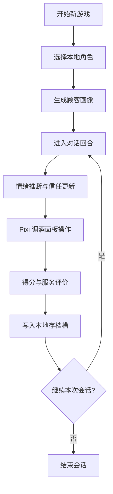
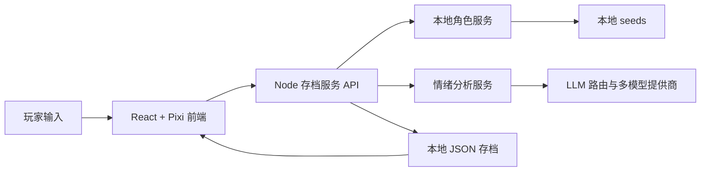

# Resonant Sips

[English](README.md) | **简体中文**

Resonant Sips 是一个赛博朋克叙事调酒互动项目。  
玩家通过对话观察顾客、推断隐藏情绪，并通过调酒结果影响信任关系与剧情走向。

## 项目概览

- **系统级创新整合**：多模型路由 + 8 维情绪推断 + Pixi 交互调酒 + 本地角色解析被整合为同一可玩闭环，而非零散功能。
- **仓库可直接运行**：`npm run dev` 可同时启动前后端，`.env.example` 给出配置模板，`npm run build` 可产出构建结果。
- **游玩与演示流程完整**：完整演示口播与流程见 `public/preview/gameplay-voiceover-guide-en.md`。
- **公开 demo 视频可访问**：已发布 YouTube 实机演示，便于快速了解完整玩法链路：<https://www.youtube.com/watch?v=o8gpBwI3ihs>。
- **本地角色库**：角色资料和肖像只从仓库内本地资产读取，并通过 `/api/mcp/...` 的 MCP 风格接口供游戏使用。

关键参考路径：

- `README.md`（英文运行与提交说明）
- `README.zh-CN.md`（中文镜像说明）
- `process book - English - 2026-04-25.md`（英文过程文档）
- `process book - Chinese - 2026-04-25.md`（中文过程文档）
- `SD5976 Process Book.pdf`（手排完成的英文 process book 成品 PDF）
- 可选：`npm run pdf:process-book:en` 可将 `process book - English - 2026-04-25.md` 自动导出为 `Resonant-Sips-Process-Book-English-2026-04-25.pdf`（需从 Markdown 重导出时使用）
- `DOC/README.md`（文档索引与维护规范）
- `DOC/当前状态与已完成.md`（与当前实现一致的状态说明）
- `DOC/开发计划与路线图.md`（计划工作与验收标准）
- `server/local-character-service.mjs`、`server/save-server.mjs`、`server/emotion-service.mjs`

## 学术诚信与版权

- 素材来源登记：`ASSET_ATTRIBUTION.md`
- 伦理与使用边界：`ETHICS_AND_USE.md`
- 角色种子合规要求：`seeds/characters/README.md`
- Storyboard 角色引用规则：角色 ID 使用 `xxxxg` 格式；每个出镜角色都应同时给出角色库与数据集 reference。

引用披露实践：

- 保留现有素材以保证项目展示连续性，并按“出镜角色 ID”逐条补充 reference。
- 若无法确认个人作者姓名，采用 ID 级声明：`Role ID + 上游链接 + 访问日期 + 非商业项目语境说明`。

## 实现亮点对照

### 1) 技术整合创新

本项目把多种前沿能力整合进同一可玩的循环：

- 多提供商大模型路由（Gemini / DeepSeek / OpenAI-compatible）。
- 可选远程 TTS，并带“文本-转写严格一致”保护。
- 本地 JSON/YAML 角色资料解析。
- 8 维情绪建模（受 Plutchik 启发）联动对话与玩法。
- Pixi.js 实时调酒交互界面。

项目的原创性主要体现在“系统级组合”上：不是单点 AI demo，而是把角色资料、情绪推断、对话行为与调酒机制打通为完整玩法流程。

### 2) 仓库工程质量

- 仓库可本地运行，步骤完整。
- 代码与文档体现了从角色到游玩/演示的工作流。
- 本地角色资料通过 MCP 风格接口接入游戏。

### 3) 团队迭代开发

项目采用短迭代方式推进，开发工作并行覆盖玩法逻辑、AI 接入、界面与资源打磨、文档维护。  
团队不是一次性堆叠功能，而是持续把分散能力收敛到稳定可玩的核心闭环，再逐步提升可靠性与展示表现。  
多成员协作痕迹可在 git 提交历史中核验，当前协作快照与实现状态见 `DOC/当前状态与已完成.md`。

### 4) 本地角色库 / MCP 接入实现

- 角色资料和肖像只从仓库内本地目录读取。
- 服务端提供并前端调用 `/api/mcp/...` 的 MCP 风格 HTTP 接口。

## 技术栈

- 前端：React 18、Vite 5
- 渲染：Pixi.js 8
- 服务端：Node.js HTTP 服务（`server/save-server.mjs`）
- 数据持久化：文件型 JSON（`saves/`、`seeds/`）
- AI 接入：OpenRouter/OpenAI-compatible + Gemini/DeepSeek 配置
- 角色格式：YAML

## 环境要求

- Node.js 18+
- npm 9+

## 安装

```bash
git clone <your-repo-url>
cd RESONANT-SIPS
npm install
```

## 环境变量配置

1. 复制 `.env.example` 为 `.env.local`。
2. 在 `.env.local` 中填写真实密钥与端点。
3. `.env.local` 只保留在本机（已被 gitignore）。

核心变量：

- `VITE_AI_PROVIDER`（`gemini` 或 `deepseek`）
- `VITE_GEMINI_API_KEY`、`VITE_GEMINI_MODEL`、`VITE_GEMINI_ENDPOINT`
- `VITE_DEEPSEEK_API_KEY`、`VITE_DEEPSEEK_MODEL`、`VITE_DEEPSEEK_ENDPOINT`
- `VITE_CHARACTER_IMAGE_MODEL`、`VITE_CHARACTER_IMAGE_ENDPOINT`
- `VITE_ENABLE_REMOTE_TTS`、`VITE_REMOTE_TTS_ENDPOINT`、`VITE_REMOTE_TTS_MODEL`
- `VITE_TTS_STRICT_TEXT_SYNC`（建议 `1`）

说明：

- 角色查询固定为纯本地模式，从 `seeds/characters/` 及受支持的本地目录读取。
- 服务端 AI 路由也会读取根目录 `.env.local`。

## 网络访问说明（中国大陆/香港）

在中国大陆或部分香港网络下，你可能需要 VPN，因为默认配置会访问以下域名：

- `openrouter.ai`（`.env.example` 默认 LLM/TTS 端点）
- `generativelanguage.googleapis.com`（Google Gemini 原生端点）

减少 VPN 依赖的建议：

1. 在 `.env.local` 使用 DeepSeek 路由（`VITE_AI_PROVIDER=deepseek` + DeepSeek key）。
2. 若 OpenRouter 不通，可关闭远程 TTS（`VITE_ENABLE_REMOTE_TTS=0`）。

可直接复制的配置模板见：

- `DOC/运行配置与资产维护.md`

配置切换命令：

- `npm run env:cnhk`
- `npm run env:global`

## 本地运行

同时启动前端 + 存档服务：

```bash
npm run dev
```

分开启动：

```bash
npm run dev:client
npm run dev:server
```

默认端口：

- 前端（Vite）：`http://localhost:5173`
- 存档/API 服务：`http://127.0.0.1:3001`

健康检查：

```text
GET http://127.0.0.1:3001/health
```

## 构建与预览

```bash
npm run build
npm run preview
```

## 路径安全检查

在提交素材或目录结构调整前，执行：

```bash
npm run check:paths
```

路径规范文档：

- `DOC/运行配置与资产维护.md`

## 游玩流程

仓库中的典型流程：

1. 从本地角色种子库选择角色。
2. 从角色上下文生成可游玩的顾客画像。
3. 进入对话、隐藏情绪推断与信任变化。
4. 在 Pixi 调酒界面完成配方操作（Body / Sweetness / Strength 轴）。
5. 结算服务结果并写入本地存档。

### Gameplay 流程图



### 系统逻辑流程图



口播脚本结构可参考：

- `public/preview/gameplay-voiceover-guide-en.md`

## 游戏 Demo 视频

最新可游玩演示视频：

- YouTube：<https://www.youtube.com/watch?v=o8gpBwI3ihs>

该视频用于帮助读者快速理解完整主链路，覆盖以下关键环节：

1. 新游戏默认角色与可选本地自定义角色配置。
2. 对话观察与隐藏情绪/信任变化。
3. Pixi 调酒面板的配方执行。
4. 递酒结算反馈与存档推进。

### 关键 Gameplay 截图

<table>
  <tr>
    <td>
      <br>
      <sub><b>1）主界面与世界观入口</b></sub>
    </td>
    <td>
      <br>
      <sub><b>2）开局前角色池配置</b></sub>
    </td>
  </tr>
  <tr>
    <td>
      <br>
      <sub><b>3）顾客对话与信任状态场景</b></sub>
    </td>
    <td>
      <br>
      <sub><b>4）调酒前情绪确认步骤</b></sub>
    </td>
  </tr>
  <tr>
    <td>
      <br>
      <sub><b>5）Serve 步骤与目标配方匹配</b></sub>
    </td>
    <td>
      <br>
      <sub><b>6）日终结算与进度反馈</b></sub>
    </td>
  </tr>
</table>

## 本地角色库与 MCP 风格接口

- 角色来源：`seeds/characters/` 下的本地角色种子；不再使用角色子模块或远程角色回退。
- MCP 风格接口（HTTP，非 MCP SDK 独立进程）：
  - `/api/mcp/character/get_by_name`
  - `/api/mcp/character/search`
  - `/api/mcp/emotion/analyze_character`

## 仓库关键结构

- `src/`：页面、组件、hooks、AI/玩法逻辑
- `src/game/pixi/`：调酒交互与氛围场景
- `server/save-server.mjs`：存档 API + MCP 风格路由
- `server/local-character-service.mjs`：本地角色加载与索引
- `server/emotion-service.mjs`：情绪分析服务
- `scripts/`：开发编排与工具脚本
- `seeds/`：默认状态与角色种子
- `saves/`：本地运行存档（内容不入库）
- `DOC/`：流程与设计文档

## 手动验证清单

- 应用可在 `http://localhost:5173` 打开
- `/health` 返回正常
- 新游戏流程会从本地默认角色池（Captain Quick 与 Aquabyte-98）中随机生成顾客
- 对话与情绪面板可持续更新
- 调酒板交互会影响游戏状态
- 存档可写入本地 slot

## 当前限制

- 暂无 `npm test` 自动化测试脚本（以手动验证为主）。
- 暂无 GitHub Actions CI 配置。
- 百科入口当前由开关关闭。
- 当前自动化测试与 CI 覆盖仍有限；项目状态以 `DOC/` 下持续维护的主文档为准。

## 安全与协作说明

- 不要把真实 API key 提交到受 Git 跟踪文件。
- `.env*` 已在忽略列表中。
- 团队共享密钥请使用私密渠道。

## 版权说明

项目内置默认角色是此前 PolyU MSc IME — AI Tools for Creative Process and Transmedia (SD5976)
课程项目期间保留的本地副本。当前应用运行时不再连接课程角色仓库或数据集。

项目中出现的相关角色，其原始版权与创作权归各角色原作者所有。
项目对保留角色资产的使用属于二次创作，仅用于课程学习、研究与展示目的。

本项目无意主张对原始角色设定的所有权，并尊重所有原作者的创作成果与知识产权。
