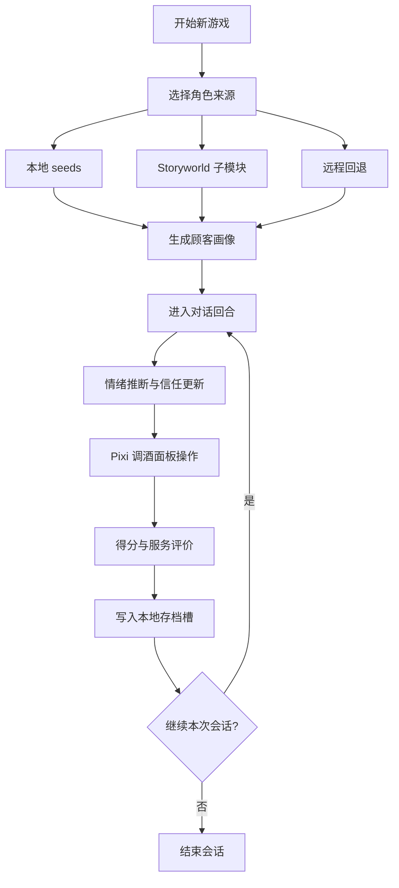
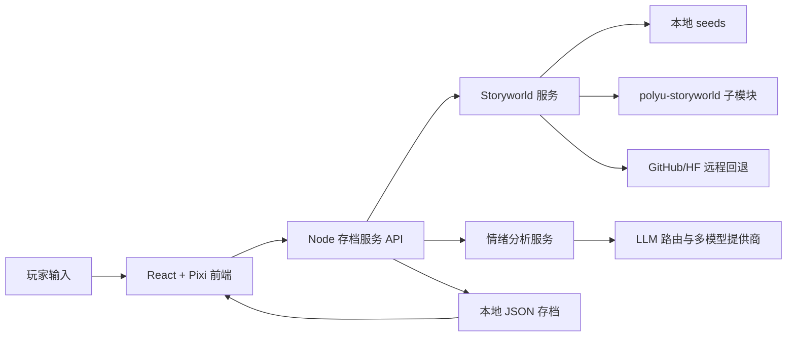

SD5976 Process Book（Detailed Chinese Edition）

项目名称：Resonant Sips  
课程：PolyU MSc IME - AI Tools for Creative Process and Transmedia (SD5976)  
团队：Resonant Sips

---

## 前言：我们记录的不是结果，而是路径

这份文档关注的是项目如何从想法变成系统。我们不把重点放在“最终做成了什么功能”，而是放在“每一步为什么这样做、遇到了什么问题、怎么判断要改、改完如何验证”。对于这门课来说，真正有价值的过程记录不是一段成功叙述，而是能够被复查、被理解、被复现的开发轨迹。

---

## 1. 起点：我们到底要解决什么问题

项目最初不是从“做一个 AI 聊天游戏”出发，而是从一个更具体的互动问题出发：玩家的理解行为能不能真实影响系统结果。我们希望玩家不是读文本的人，而是通过判断和行动改变关系的人。因此玩家身份被设定为调酒师。玩家先在对话中观察顾客状态，再在调酒行为中做出回应，系统最终通过信任变化、结算差异和后续互动反馈这个回应是否有效。

赛博朋克酒吧并不是单纯视觉选择。这个语境天然存在“角色外在表现”和“真实情绪”之间的张力，适合做情绪推断机制。与此同时，调酒系统提供了规则化操作空间，厚度、甜度、烈度可以把抽象情绪转译为可执行参数，让叙事判断真正进入玩法。

### 1.1 Ideation 参考：我们从《潜水员戴夫》借鉴了什么

在 ideation 阶段，我们的重要参考对象之一是《潜水员戴夫》（*Dave the Diver*）。我们并没有把它当作“照搬模板”，而是把它作为一个“如何把多系统打包成连贯体验”的参考样本。

对我们最有启发的优势主要有三点：

1. **阶段化主循环清晰**：把不同类型任务分阶段组织，能让玩家在同一局里保持目标清晰，同时感到持续推进。
2. **贴世界观的二级菜单设计**：菜单不只是功能入口，也可以成为叙事的一部分。其“手机 UI 作为系统入口”的思路启发了我们对二级菜单和信息层级的设计。
3. **复古风格与现代可读性的结合**：在风格化像素/复古表达下，仍保持界面可读、反馈明确，这对玩法决策非常关键。

这些启发在 Resonant Sips 中的转译方式：

- 我们把流程明确切成“开局配置 -> 对话判断 -> 调酒执行 -> 结算推进”，每一步都有清晰的决策重点。
- 我们把 profile/history/context 等二级面板当成“互动叙事界面”，而不只是工具窗口，强调可理解、可沉浸的界面路径。
- 美术上坚持 future-retro cyberpunk 方向，让霓虹、像素化表达与界面框架共同服务氛围，同时保证情绪判断与配方反馈的可读性。

该 ideation 参考可见于以下资料：

- Unity 案例（2D/3D 融合、制作与呈现策略）：https://unity.com/case-study/dave-diver
- Game Developer 访谈（阶段划分、循环扩展、世界连接逻辑）：https://www.gamedeveloper.com/design/dave-the-diver

### 1.2 Reference -> Translation 对照快照

为保证 ideation 可追溯，我们把“借鉴点”与“实现决策”做一一对应：

- **借鉴重点：阶段化主循环**
  - **在 Resonant Sips 中的转译：**把单局节奏明确为“配置 -> 对话 -> 调酒 -> 结算推进”四段式流程。
  - **实现证据路径：**`src/pages/NewGameSetupPage.jsx`、`src/hooks/useCustomerFlow.js`、`src/game/pixi/`。
  - **截图证据：**`Art-assets/Art assets/游戏截屏/03_new_game_setup_character_pool.png`、`Art-assets/Art assets/游戏截屏/05_dialogue_with_customer.png`、`Art-assets/Art assets/游戏截屏/09_mixing_serve_step.png`、`Art-assets/Art assets/游戏截屏/11_end_of_day_summary.png`。

- **借鉴重点：贴世界观的手机式二级菜单逻辑**
  - **在 Resonant Sips 中的转译：**profile/history/context 面板被设计为叙事 UI 层，而不是独立工具窗口。
  - **实现证据路径：**`src/hooks/useDialogue.js`、`src/components/Common/CopyrightModal.jsx`、`src/pages/` 下对话场景模块。
  - **截图证据：**`Art-assets/Art assets/游戏截屏/06_dialogue_chat_history_overlay.png`。

- **借鉴重点：风格化美术与交互可读性并存**
  - **在 Resonant Sips 中的转译：**坚持 future-retro cyberpunk 风格，同时保证信任、情绪和配方判断的读屏效率。
  - **实现证据路径：**`src/game/pixi/`、`src/styles/`、`src/components/` 中 HUD/状态相关组件。
  - **截图证据：**`Art-assets/Art assets/游戏截屏/02_main_menu_resonant_sips.png`、`Art-assets/Art assets/游戏截屏/07_mixing_emotion_confirmation.png`、`Art-assets/Art assets/游戏截屏/08_mixing_calibration_glass_step.png`。

### 1.3 设计流程与系统结构（Mermaid 流程图）

在设计与迭代过程中，我们保持一套稳定的设计契约：一条可验证的玩法路径 + 一条可追踪的运行时数据路径。下述两张图与公开仓库中 `README.md` / `README.zh-CN.md` 的「游玩流程」章节**完全一致**，作为过程文档与仓库说明的对照，而不是第二套平行规格。

**Gameplay 流程图（玩家侧节奏）：**

**系统逻辑流程图（代码侧组合方式）：**

在收敛阶段，我们以此作为判断标准：如果某个功能不能映射到上述主链路，就先视为与当前核心闭环暂不对齐，避免再次扩张旁支导致稳定性崩坏。

---

## 2. 从无到有：完整研发过程

### 2.1 基础搭建阶段

第一个阶段我们优先把工程底盘搭起来，包含 React + Vite 前端、Node 存档服务、环境变量模板、启动脚本和基础目录规范。这个阶段的目标很明确：让每位成员可以在本地稳定复现同一运行环境。没有这一步，后续所有优化都无法形成可比较证据。

同阶段我们接入了 `venetanji/polyu-storyworld` 子模块。这个动作的重要性在于它为角色来源建立了可追溯路径，后续所有角色相关能力都必须能指回这一来源或其缓存映射。

### 2.2 功能发散与中期收敛

中期我们经历了典型的“功能扩张快于稳定性”的阶段。商店、章节、图鉴、成就、事件等模块并行推进后，状态复杂度快速提升，主流程开始被边缘系统牵制。团队在这个节点做了结构性调整：主动下线干扰项，把开发资源集中到主链路，即“顾客到访 -> 对话观察 -> 情绪判断 -> 调酒执行 -> 结果结算”。

这次调整是项目的分水岭。它让系统从“功能看起来很多”转向“核心流程可控”。后续每个迭代都围绕主链路验证，不再被分支逻辑拖散。

### 2.3 Storyworld 真接入阶段

我们把顾客来源从随机模板切到角色池机制，玩家在新游戏配置页添加并启用角色 ID，运行时顾客优先来自启用池。这样做的意义是把“课程角色库接入”从文档宣称变成可执行事实。

服务层方面，项目落地了 MCP 风格接口：角色检索、角色搜索和情绪分析统一在后端能力层处理，前端通过稳定接口调用。这一结构降低了前端直连多源数据的复杂度，也使错误处理和缓存策略更一致。

### 2.4 情绪结构化阶段

情绪机制从“文本判断”升级为“结构化状态”。我们采用固定 8 维情绪集合，要求模型按 JSON 协议输出，再经过后处理硬规则，包括缺失补齐、范围限制、归一化和 top3 重算。处理后的结果写入运行时，参与情绪判断、调酒目标与结算反馈。

这一步是系统性质变化的关键点。AI 输出不再停留在文本层，而被转译成规则层输入，整个链路因此可验证、可调参、可复盘。

### 2.5 稳定性收口阶段

后期重点是“失败时不崩”。我们补了模型失败回退、网络失败提示、加载页恢复出口、防复读参数、流式等待态，以及存档并发写入修复。这个阶段几乎没有“炫目新功能”，但它决定了项目能否在真实演示场景下稳定运行。

---

## 3. 原创价值：我们做的不是功能拼接

项目原创性不在“用了某个模型”，而在“把非确定输出组织成确定行为”。我们建立的是一条完整转换链：语义输入进入规则变量，再通过交互机制反馈给玩家。简而言之，就是“感性语义 -> 逻辑变量 -> 互动反馈”。

如果缺少这条转换链，对话只会变成表面装饰，调酒只会是参数点击。正是因为状态层打通，玩家的理解行为才会在系统中产生可见后果。这是项目与普通 AI Demo 的根本区别。

---

## 4. 模型优化：我们持续优化了什么

需要明确说明的是，团队没有做模型权重重训练，也没有进行 fine-tuning。我们做的是运行时持续调优，核心包括提示词约束、输出协议、后处理校验、回退策略和参数调优。

在角色输出层面，我们统一了数据链路 `source.yaml -> profile.json -> runtime context`，减少语料噪声。情绪输出被限制为 8 维合法集合并强制清洗，异常时回退 heuristic，保证流程不断。对话层通过防复读约束和采样参数调整提升稳定性。我们不是追求“更会写”，而是追求“更可控、更贴角色、更可用于玩法”。

---

## 5. 模型生图与视觉一致性流程

在美术资产侧，项目使用可配置的图像模型 API 生成角色概念图和透明背景立绘。角色 `profile.json` 与已有 portrait 共同约束提示词，服务端负责模型调用、响应校验、尺寸处理、透明背景处理、文件落盘和缓存失效，从而减少不同角色之间的画幅、色调和轮廓差异。

这条流程由 `server/character-image-service.mjs` 和 `/api/mcp/character/generate_images` 提供，不直接参与调酒或情绪判定。生图失败时保留现有图像或使用明确占位，不阻断核心玩法；生成结果统一进入角色目录和 `public/asset/角色/cutout/`，并继续遵守素材来源与演示用途登记要求。

---

## 6. 失败与挑战：哪些问题最难

最大的一次失败不是代码报错，而是方案不稳定。我们曾尝试让更自由的 AI 输出直接驱动调酒目标，结果在测试中出现可计算性不足和结果不可复现。最终回退到结构化 8 维驱动后，系统可解释性和可玩性明显提升。这是一次典型的“表达自由与系统稳定”的取舍。

另一类高风险问题来自状态层。我们遇到新开局继承旧会话状态污染，也遇到并发写入导致临时文件重命名失败。这些问题不易在早期察觉，却会在演示时直接破坏流程。通过回灌策略修复和原子写入改造后，系统稳定性才真正达到可交付标准。

网络波动和模型可用性问题同样带来挑战。我们通过本地优先、远端回退、错误可视化和恢复入口来降低不确定性，让用户不会在无提示状态下被卡住。

---

## 7. 团队协作：真实贡献如何体现

我们采用“主链路先收口，外围并行优化”的协作方式。先稳定核心状态和服务，再并行推进 UI、资源、文档和展示表达。这样可以显著降低冲突，提高迭代效率。

从仓库历史能看到多成员持续贡献，但我们更看重职责与证据对应。有人主抓服务与状态稳定，有人负责交互体验与界面细节，有人处理资产一致性与展示素材，有人持续维护文档、版权披露与发布规范。这种分工是项目能同时兼顾深度与完整度的原因。

---

## 8. Reflection in Action：AI 改变了我们的工作方式

AI 带来的最大变化是开发重心迁移。过去更多是写固定分支逻辑，现在更多是定义边界和约束，再让生成结果进入规则系统。我们投入在协议设计、后处理、回退策略和可观测性上的精力明显增加。

第二个变化是责任结构变化。AI 提升了动态性，也增加了不确定性。为了让系统可交付，我们必须在生成层之外建立稳定层。对我们来说，AI 不是可无条件信任的作者，而是需要被边界化管理的动力源。这个认识是项目中最重要的反思结果。

---

## 9. 展示策略：如何让读者快速看懂（含素材占位）

素材应按“背景 -> 机制 -> 结果 -> 可靠性”顺序呈现。主界面和配置页建立背景，角色读取与情绪判断说明机制，调酒与结算展示结果，错误恢复页面证明可靠性。视频建议保留一条完整游玩链路和一条技术链路短视频，分别覆盖体验与解释。

目前完整 gameplay 已发布，可在项目说明中直接引用：

【视频 D1：完整 gameplay 演示】https://www.youtube.com/watch?v=o8gpBwI3ihs

该视频可作为主证据，连续展示“新游戏配置 -> 对话与情绪判断 -> 调酒执行 -> 结算反馈”的完整体验链路。以下为已接入的 gameplay 截图组（来自真实游玩过程）：

S1 主界面（世界观建立）  

S2 新游戏配置页（角色池）  

S3 对话阶段（顾客互动场景）  

S4 调酒前情绪确认  

S5 调酒执行（校准步骤）  

S6 递酒结果与目标匹配反馈  

S7 日终反馈与进度推进  

【视频占位 D2】技术链路演示（1-2 分钟，可后续补充）

流程图建议导出高清截图并嵌入正文，而不是只保留代码块。读者往往先看图后读文，图像证据会显著提升理解速度。

---

## 10. 伦理与资产边界

我们在项目中同时坚持来源透明和可替换能力建设。角色与素材引用保留来源与访问记录，真实密钥不入库，仅本地注入。这些做法不是形式化附加内容，而是保证项目在学术环境中可追溯、可维护、可延续的必要条件。

---

## 11. 可追溯性说明（对应仓库证据）

本文中的关键叙述可在仓库中找到对应痕迹。历史 Storyworld 接入记录保留在上文；当前纯本地角色服务与 MCP 风格路由可见于 `server/local-character-service.mjs` 与 `server/save-server.mjs`；情绪结构化、后处理与回退可见于 `server/emotion-service.mjs`、`src/utils/ai/customerGeneration.js`；角色池与流程收敛可见于 `src/pages/NewGameSetupPage.jsx`、`src/hooks/useCustomerFlow.js` 及相关提交记录；对话防复读与参数调优可见于 `src/utils/aiService.js`、`src/hooks/useDialogue.js`；存档稳定性修复可见于 `server/save-server.mjs`。

模型生图与资产缓存的实现可见于 `server/character-image-service.mjs`、`server/local-character-service.mjs`、`src/utils/localCharacterRepository.js`、`shared/runtimeApiConfig.js` 与 `DOC/运行配置与资产维护.md`。该流程用于统一角色视觉资产，并与运行时主链路保持解耦。

---

## 12. 结论

Resonant Sips 最终交付的不是一组功能清单，而是一条可运行、可解释、可复盘的创作流程。我们把角色资产、语言生成、情绪建模、交互反馈和工程稳定性组织到同一系统里，并通过持续取舍把它打磨到可展示状态。这就是我们对 "Document your process" 的真实回应。
