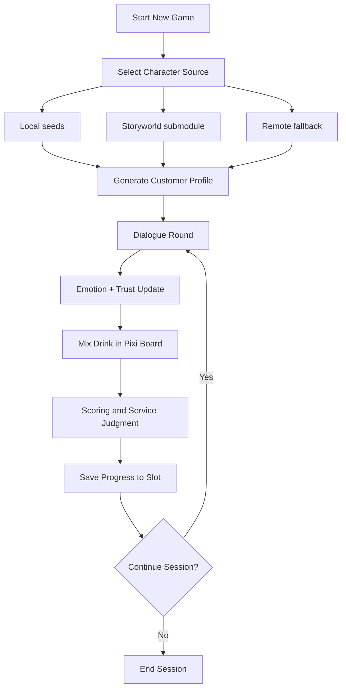
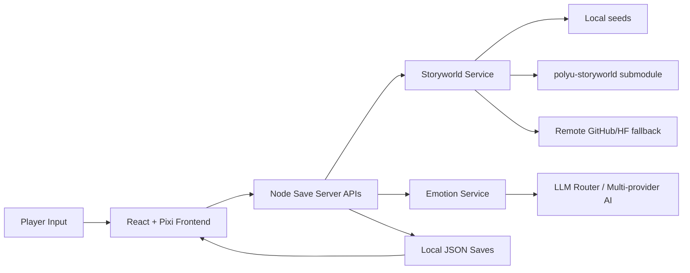

SD5976 Process Book (Detailed English Edition)

Project: Resonant Sips  
Course: PolyU MSc IME - AI Tools for Creative Process and Transmedia (SD5976)  
Team: Resonant Sips

---

## Introduction: this document records decisions, not just results

This process book is written as a development record rather than a feature showcase. Our goal is to make the path visible: what we tried, why we changed direction, what failed, how we fixed it, and how each change affected the system. For this course, process quality is not about listing tools. It is about showing reasoning, iteration, and evidence.

---

## 1. Project origin: from creative question to executable objective

Resonant Sips did not begin as "an AI game idea." It began as a design question: in narrative interaction, what should AI do beyond producing convincing text. We wanted AI to affect gameplay logic, not remain a decorative dialogue layer. That is why the player role became a bartender. The player reads the guest through conversation, responds through mixing actions, and receives explicit system feedback through trust movement, settlement differences, and relationship progression.

The cyberpunk bar setting was selected for structural reasons. It naturally supports a gap between surface behavior and hidden emotional state, which makes emotion inference gameplay meaningful. At the same time, cocktail mixing offers operational variables, so abstract interpretation can be translated into actionable mechanics.

### 1.1 Ideation reference: what we borrowed from Dave the Diver

In ideation, one of our strongest reference points was *Dave the Diver*. We did not treat it as a template to copy mechanics; we treated it as a benchmark for how to package multiple systems into a coherent player-facing rhythm.

Three design advantages were especially instructive for us:

1. **Clear phase-based loop design**: day/night or phase separation helps players focus on one cognitive task at a time, while still feeling progression across the full session.
2. **Diegetic secondary-menu thinking**: interface layers that feel in-world (rather than abstract dev UI) reduce friction and improve identity. Its phone-centric interaction model influenced our own secondary-menu thinking and information hierarchy.
3. **Hybrid visual direction with strong readability**: combining stylized retro language with modern depth/lighting can keep scenes expressive without sacrificing clarity for gameplay decisions.

How this translated into Resonant Sips:

- We structured gameplay into recognizable phases (setup -> dialogue interpretation -> mixing execution -> settlement/progression), so each stage has a clear decision focus.
- We treated secondary UI panels (profile/history/context modules) as part of interaction storytelling, not only as utility windows, following the same "in-world usability" principle.
- We committed to a future-retro cyberpunk tone where neon, pixel stylization, and interface framing support mood while preserving legibility for emotion and recipe judgment.

Reference notes for this ideation influence:

- Unity case study on *Dave the Diver* (2D/3D blend, production and presentation choices): https://unity.com/case-study/dave-diver
- Game Developer interview (phase separation, loop expansion, connected-world framing): https://www.gamedeveloper.com/design/dave-the-diver

### 1.2 Reference -> Translation snapshot

To keep ideation traceable, we map each borrowed principle to a concrete implementation decision:

- **Reference focus: phase-separated loop**
  - **Translation in Resonant Sips:** setup -> dialogue -> mixing -> settlement/progression as a clear four-stage session rhythm.
  - **Evidence paths:** `src/pages/NewGameSetupPage.jsx`, `src/hooks/useCustomerFlow.js`, `src/game/pixi/`.
  - **Visual evidence:** `Art-assets/Art assets/游戏截屏/03_new_game_setup_character_pool.png`, `Art-assets/Art assets/游戏截屏/05_dialogue_with_customer.png`, `Art-assets/Art assets/游戏截屏/09_mixing_serve_step.png`, `Art-assets/Art assets/游戏截屏/11_end_of_day_summary.png`.

- **Reference focus: phone-like, diegetic secondary menu logic**
  - **Translation in Resonant Sips:** profile/history/context panels are treated as narrative UI layers, not separate debugging utilities.
  - **Evidence paths:** `src/hooks/useDialogue.js`, `src/components/Common/CopyrightModal.jsx`, dialogue scene modules under `src/pages/`.
  - **Visual evidence:** `Art-assets/Art assets/游戏截屏/06_dialogue_chat_history_overlay.png`.

- **Reference focus: stylized visual identity with readable interaction**
  - **Translation in Resonant Sips:** future-retro cyberpunk style is kept while preserving gameplay readability for trust, emotion, and recipe judgments.
  - **Evidence paths:** `src/game/pixi/`, `src/styles/`, gameplay HUD/state components in `src/components/`.
  - **Visual evidence:** `Art-assets/Art assets/游戏截屏/02_main_menu_resonant_sips.png`, `Art-assets/Art assets/游戏截屏/07_mixing_emotion_confirmation.png`, `Art-assets/Art assets/游戏截屏/08_mixing_calibration_glass_step.png`.

### 1.3 Design flow and system architecture (Mermaid)

During design, we kept a stable contract: one canonical gameplay path and one runtime data path. These diagrams are the same as the public `README.md` "Gameplay Workflow" section (this repo, not a separate spec).

**Gameplay path (player-facing cadence):**

**System / logic path (how it composes in code):**

These stayed stable across iterations. When a feature could not be mapped to these flows, it was treated as out-of-scope for the play loop until the core was reliable.

---

## 2. From zero to playable: full development process by phase

### 2.1 Foundation phase

The first phase focused on engineering basics. We built a React + Vite frontend, a Node save/API service, environment templates, and runnable scripts so all team members could work against a reproducible local baseline. This looked simple, but it was essential. Without reproducibility, later AI and gameplay iteration would have produced inconsistent outcomes.

During the same phase, we integrated the `venetanji/polyu-storyworld` submodule. This established a traceable character source and aligned the project with the course ecosystem from the beginning.

### 2.2 Expansion and mid-cycle consolidation

In the middle phase, we experienced a common failure mode: feature breadth grew faster than system stability. Multiple side systems were developed in parallel, and core flow quality started to degrade. At that point, we made a deliberate reduction. We temporarily removed distracting branches and concentrated development on one complete core path: guest arrival, dialogue observation, emotion judgment, mixing execution, and settlement feedback.

This decision was the project's turning point. It reduced surface complexity and improved delivery quality, giving every subsequent iteration a clear validation target.

### 2.3 Storyworld integration as runtime behavior, not documentation claim

After consolidation, we replaced random placeholder guest flow with explicit character-pool logic. Players manage character IDs in new-game setup, and runtime guest generation follows that pool instead of silent fallback defaults. This made Storyworld integration operational, not just descriptive.

At the service layer, we implemented MCP-style endpoints for character lookup, character search, and emotion analysis. This moved data handling from fragmented frontend logic into stable backend capabilities, improving both reliability and traceability.

### 2.4 Emotion structuring phase

Emotion moved from descriptive output to structured state. We constrained analysis to an 8-axis schema, enforced JSON output, and applied strict post-processing including completion, bounds checks, normalization, and top-rank recalculation. Cleaned outputs were written into runtime state and used by gameplay judgment and settlement.

This phase changed the nature of the project. AI output became system input, and the full loop became testable and explainable.

### 2.5 Reliability hardening phase

In the final phase, we prioritized resilience over feature expansion. We improved model fallback behavior, network error visibility, recovery exits for blocked states, anti-repetition controls, and atomic save stability. The purpose was practical: under real demonstration constraints, the system had to keep running.

---

## 3. Value and novelty: where originality actually appears

The originality of this project is not that it uses advanced models. The originality lies in how non-deterministic outputs are converted into deterministic game behavior and then reflected back to players through interaction outcomes. In short, we designed a full conversion chain from semantic interpretation to rule-state variables to visible feedback.

Without this chain, dialogue remains cosmetic and mixing remains mechanical. With it, player interpretation becomes actionable and system response becomes explainable. This system-level integration is the core contribution.

---

## 4. Model optimization: what we did, and what we did not do

We need to state this precisely. The team did not retrain model weights and did not run fine-tuning as part of this project. Our optimization work was runtime-oriented. "Continuous model optimization" in this project means iterative refinement of prompt constraints, output contracts, validation rules, fallback logic, and parameter settings.

We standardized the data path from `source.yaml` to `profile.json` to runtime context to reduce noise. We constrained emotion output to a legal 8-axis set and enforced post-processing for computational reliability. When model output failed or degraded, heuristic fallback preserved flow continuity. Dialogue stability was improved through anti-repetition constraints and generation parameter tuning. The objective was not stronger prose. The objective was role-consistent, controllable output that supports gameplay logic.

---

## 5. Model-based image generation and visual consistency

The project uses configurable image-model APIs to generate character concept images and transparent-background cutouts. Character `profile.json` data and an existing portrait constrain the prompt, while the server handles model requests, response validation, resizing, transparency processing, file output, and cache invalidation. This reduces inconsistencies in framing, tonal profile, and silhouette across characters.

The pipeline is provided by `server/character-image-service.mjs` and `/api/mcp/character/generate_images`; it does not participate in cocktail or emotion judgment. A generation failure preserves the existing image or a clear placeholder instead of blocking core gameplay. Generated results enter the character asset directories and `public/asset/角色/cutout/`, and remain subject to attribution and demonstration-use records.

---

## 6. Failure cases and key challenges

Our most important failure was a design-path failure. We tested a freer method where AI output directly drove mixing targets. The text quality looked strong, but the resulting values were difficult to compute and reproduce. We rolled this approach back and adopted structured 8-axis weighting. This was a clear trade-off: reduced expressive freedom in exchange for stability, comparability, and explainability.

A second high-risk challenge appeared in the state layer. We encountered cross-session state pollution and atomic write conflicts under concurrent conditions. These issues were not always obvious in UI, but they could break live demonstrations. We fixed them by tightening state rehydration behavior and strengthening atomic save handling. This changed our internal understanding of risk: in narrative systems, state integrity often matters more than text sophistication.

Network variability and model availability created additional instability in character loading and analysis. We addressed this through local-first strategy, remote fallback, visible error signaling, and explicit recovery exits, preventing silent dead-end states.

---

## 7. Team collaboration and contribution logic

The team followed a "stabilize core first, refine in parallel" collaboration strategy. We first secured core state and service behavior, then advanced UI polish, asset consistency, and documentation quality in parallel. This reduced integration conflicts and improved iteration efficiency.

Multi-author contribution is visible in repository history, but role-to-artifact mapping is more important than raw commit counts. Some members focused on service reliability and state behavior, some improved interaction and dialogue quality, some handled visual asset consistency and media integration, and some maintained process documentation, attribution clarity, and release readiness.

---

## 8. Reflection in action: how AI changed the way we worked

AI changed our pipeline structure. The workflow shifted from writing fixed branches first to defining constraints first, generating candidates, and validating them through rule layers. This moved effort from pure feature coding toward schema design, post-processing, fallback strategy, and runtime observability.

AI also changed responsibility boundaries. It increased narrative variation and replay value, but also introduced uncertainty and hidden failure modes. To keep the system trustworthy, we had to build explicit constraint and recovery layers around generation. In this project, AI is not treated as an autonomous author. It is treated as a high-capability engine that must be bounded by design.

---

## 9. Media strategy for clear communication (with insertion placeholders)

For readability, we recommend organizing evidence in a context-mechanism-result-reliability sequence. Interface and setup establish context. Character retrieval and emotion judgment explain mechanism. Mixing and settlement show outcomes. Recovery/error-state visuals demonstrate reliability design. A full gameplay video plus a short technical pipeline video together provide both experiential and technical evidence.

The gameplay demo video has now been published and can be referenced directly in project communication:

[Video D1 - Full gameplay walkthrough] https://www.youtube.com/watch?v=o8gpBwI3ihs

This video serves as the primary end-to-end evidence clip, showing one continuous playable session from setup to outcome feedback.

Integrated screenshot set (captured from actual gameplay run):

S1 Main interface / world setup  

S2 New game setup / character pool  

S3 Dialogue stage (customer interaction context)  

S4 Emotion confirmation before mixing  

S5 Mixing execution (calibration step)  

S6 Serve result and profile match feedback  

S7 End-of-day feedback and progression  

[Video D2] Technical pipeline clip (1-2 min) - optional future addition

Process diagrams should be exported as high-resolution images and embedded directly, because visual evidence is typically processed before detailed text in most reading contexts.

---

## 10. Ethics, attribution, and asset boundaries

The project maintains two parallel commitments: transparent use of course character assets and gradual increase of replaceable asset capability. Character and asset usage keeps source and access-date records. Real API credentials remain local and are never committed. These decisions are not formal add-ons. They are part of making the project auditable, maintainable, and academically responsible.

---

## 11. Traceability note (repository evidence)

Key statements in this document map to observable repository traces. The historical Storyworld integration is documented above; the current local-only character service and MCP-style routes are visible in `server/local-character-service.mjs` and `server/save-server.mjs`. Structured emotion analysis, validation, and fallback behavior are visible in `server/emotion-service.mjs` and `src/utils/ai/customerGeneration.js`. Character-pool flow and runtime integration can be traced through `src/pages/NewGameSetupPage.jsx` and `src/hooks/useCustomerFlow.js`. Dialogue anti-repetition and parameter tuning appear in `src/utils/aiService.js` and `src/hooks/useDialogue.js`. Save-path reliability fixes are visible in `server/save-server.mjs`.

Model image generation and asset caching are traceable through `server/character-image-service.mjs`, `server/local-character-service.mjs`, `src/utils/localCharacterRepository.js`, `shared/runtimeApiConfig.js`, and `DOC/运行配置与资产维护.md`. This pipeline maintains visual consistency while remaining decoupled from the runtime gameplay rules.

---

## 12. Closing statement

Resonant Sips does not only deliver an AI-enabled game. It delivers a reproducible creative pipeline that connects character assets, non-deterministic language generation, emotion modeling, interaction feedback, and engineering reliability.  
What we completed is not a set of isolated features, but a process that can be inspected, repeated, and extended.
